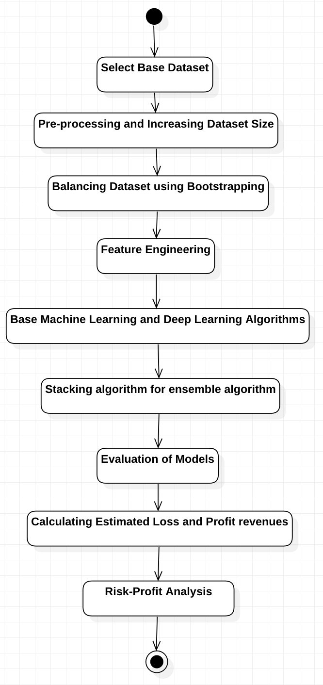
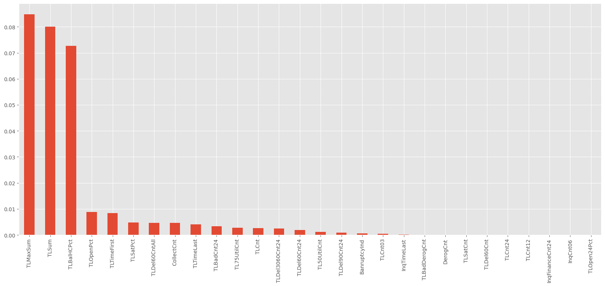
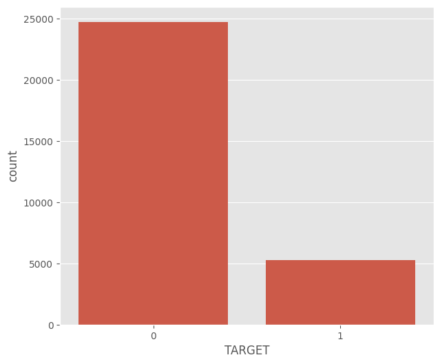
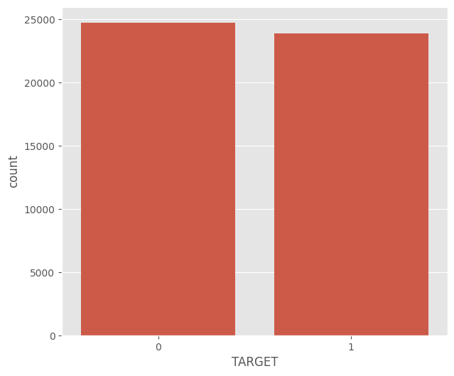
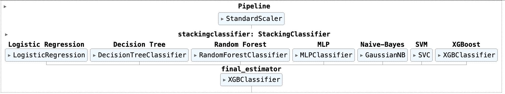
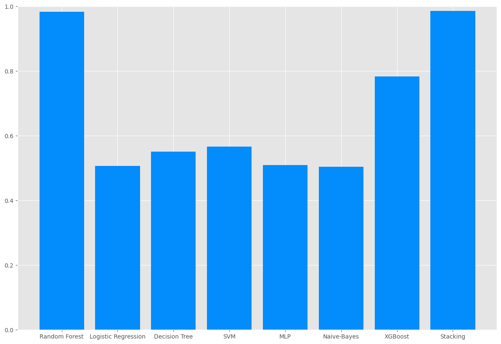

# Credit Risk-Profit Analysis

## 📋 Project Overview
This project predicts credit risk using machine learning, enabling financial institutions to classify loans as "good" or "bad" while optimizing profits. Using a stacked ensemble model, we achieved an **accuracy of 97.7%**, providing actionable insights to improve decision-making for lending.

## 🎯 Objectives
1. Predict credit risk using historical customer data.
2. Address class imbalance in low-default datasets using augmentation methods (e.g., SMOTE, CTGAN).
3. Build a profit-risk model to optimize lending strategies based on estimated revenues and losses.

## 📊 Dataset
- **Source**: SAS Enterprise Miner’s Credit Risk Dataset.
- **Size**: 30,000 records with 30 attributes.
- **Target Classes**:
  - `0` = Good Loan (Customer repays loan).
  - `1` = Bad Loan (Customer defaults on loan).

## 🛠️ Features
1. **Preprocessing**:
   - Imputation for missing values using medians.
   - Class balancing via **SMOTE** and **Bootstrapping**.
   - Synthetic dataset creation using **CTGAN**.

2. **Feature Engineering**:
   - Mutual Information Gain for selecting top 10 impactful features.
   - Pearson Correlation Analysis to avoid multicollinearity.

3. **Modeling**:
   - Base Learners:
     - Logistic Regression, Decision Trees, Random Forests, Support Vector Machines (SVM), Naïve Bayes, Multi-Layer Perceptrons (MLP).
   - Stacking Ensemble:
     - Combines base learners using XGBoost as the meta-learner.
   - Best Model: Stacked Ensemble with **98.55% accuracy**.

4. **Profit-Risk Analysis**:
   - Estimated profit/loss per borrower using decile/percentile methods.
   - Loans granted up to the **52nd percentile** ensured positive revenue.

## 🖼️ Key Visuals
### Architecture Diagram

### Mutual Information Gain

### Class Balancing
**Before Bootsrapping Method:**

**After Bootsrapping Method:**

### Stacking Model

### Model Accuracies

### Capstone Project Poster

