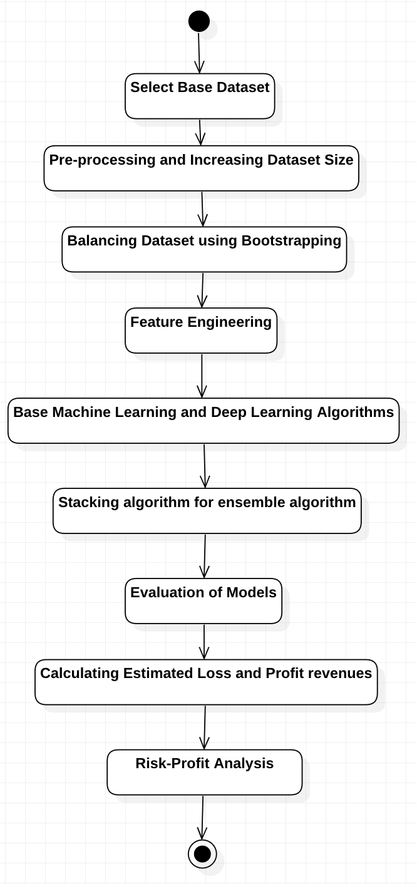
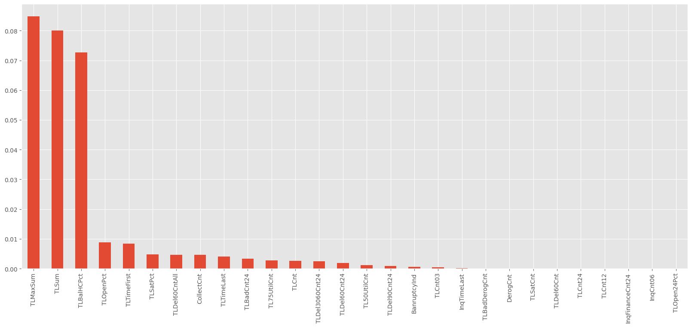
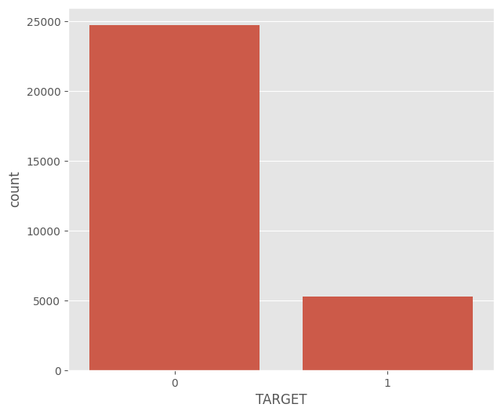
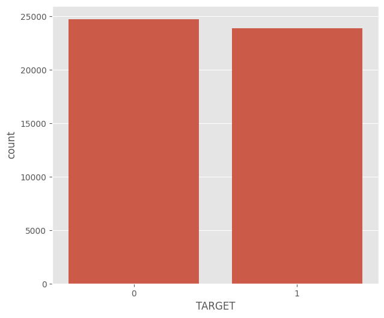
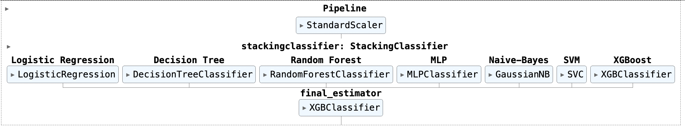
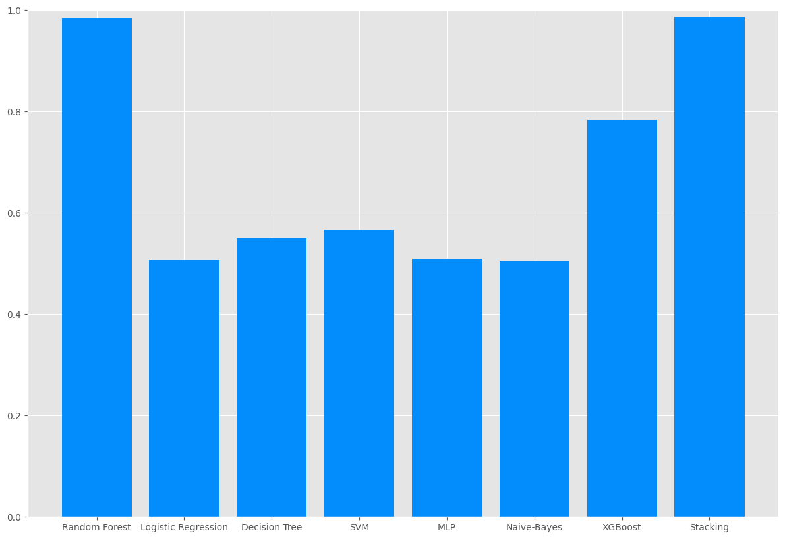

# Credit Risk-Profit Analysis

## Project Overview
This project predicts credit risk using machine learning, enabling financial institutions to classify loans as "good" or "bad" while optimizing profits. Using a stacked ensemble model, the project demonstrates how borrower data can be used to make lending decisions and estimate portfolio-level profitability.

## Objectives
1. Predict credit risk using historical customer data.
2. Address class imbalance in low-default datasets using augmentation methods (SMOTE, CTGAN).
3. Build a profit-risk model to optimize lending strategies based on estimated revenues and losses.

## Dataset
- **Source**: SAS Enterprise Miner's Credit Risk Dataset.
- **Size**: 30,000 records with 30 attributes.
- **Target Classes**:
  - `0` = Good Loan (Customer repays loan).
  - `1` = Bad Loan (Customer defaults on loan).

## Features

### Preprocessing
- Imputation for missing values using medians.
- Class balancing via **SMOTE** and **Bootstrapping**.
- Synthetic dataset creation using **CTGAN**.

### Feature Engineering
- Mutual Information Gain for selecting top 10 impactful features.
- Pearson Correlation Analysis to reduce multicollinearity.

### Modeling
- **Base Learners:** Logistic Regression, Decision Trees, Random Forests, Support Vector Machines (SVM), Naïve Bayes, Multi-Layer Perceptrons (MLP).
- **Stacking Ensemble:** Combines base learners using XGBoost as the meta-learner.

### Profit-Risk Analysis
- Estimated profit and loss per borrower using decile/percentile segmentation.
- Identified an approval cutoff that balances portfolio risk against expected revenue.

## Key Visuals

### Architecture Diagram

### Mutual Information Gain

### Class Balancing
**Before Bootstrapping Method:**

**After Bootstrapping Method:**

### Stacking Model

### Model Comparisons

### Capstone Project Poster

