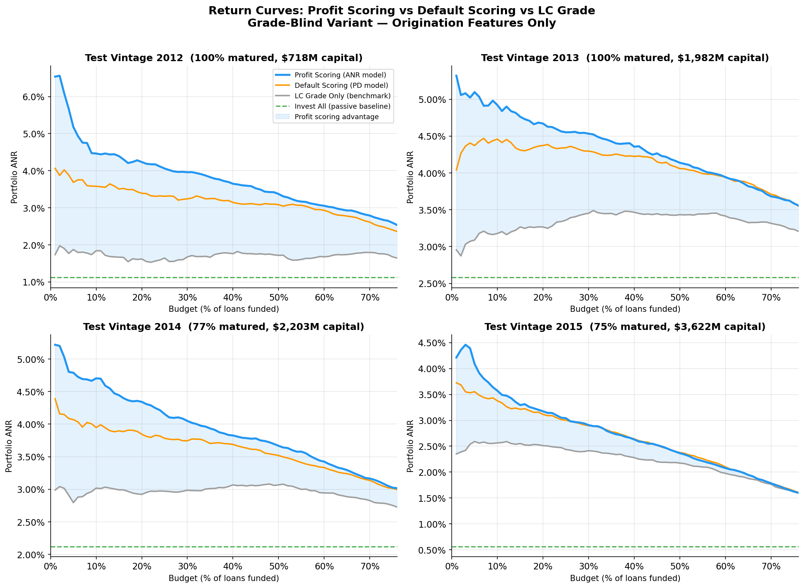
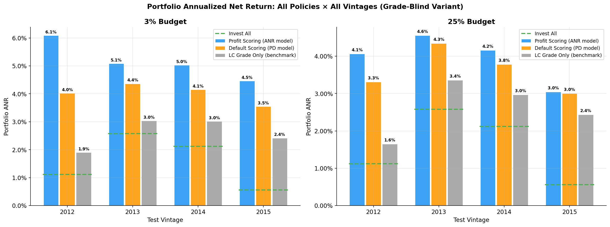
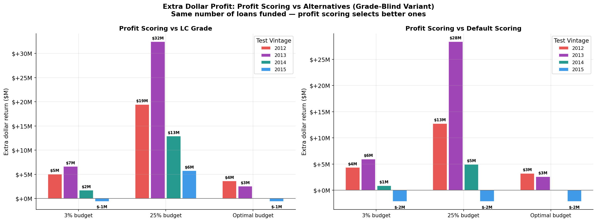

# Credit-Profit-Risk Analysis

**Can a machine-learning model beat LendingClub's own loan grading when selecting a portfolio of personal loans?**

Yes, by a margin of **200–460 basis points in annualized portfolio return**, validated across four independent test cohorts (2012–2015).

**[Live demo →](https://loan-alpha.streamlit.app/)**

---

## The Core Insight

Standard credit risk models on LendingClub data hit a structural ceiling: LC *already* prices default risk into the interest rate, so a model that only approves or rejects loans adds almost nothing (optimal approval rate ≈ 99%). The problem isn't the model, it's the framing.

This project reframes the task the way the credit-risk literature does for peer-to-peer lending: instead of **lender accept/reject**, model it as **investor portfolio selection**. Rank all available loans by predicted *annualized net return* (not predicted default), invest in the top fraction, and measure realized portfolio return. The profit-scoring model consistently beats LC's grade ordering because it identifies which loans over-compensate for their actual risk, not just which ones are safest.

> *Literature backing: Serrano-Cinca & Gutiérrez-Nieto, EJOR 2016; Bastani et al., EJOR 2021*

---

## Results

Profit scoring (ANR model) vs LC grade-only ordering —-> out-of-time backtest, full data, matured loans only:

| Test Vintage | Capital | Matured | Profit Scoring @3% | vs LC Grade | vs Invest-All |
|---|---|---|---|---|---|
| 2012 (train: 2007–2011) | $718M | **100%** | +6.09% | **+418 bp** | +497 bp |
| 2013 (train: 2007–2012) | $1,982M | **100%** | +5.08% | **+205 bp** | +250 bp |
| 2014 (train: 2007–2013) | $2,203M | 77% | +5.03% | **+201 bp** | +291 bp |
| 2015 (train: 2007–2014) | $3,622M | 75% | +4.46% | **+204 bp** | +390 bp |

- Advantage holds at every budget level (1%–75%) in every vintage
- 2012 and 2013 vintages are 100% matured —-> exact realized cashflows, no survival estimates
- Default scoring (PD model alone) beats LC grade by ~130 bp; profit scoring adds another ~80–300 bp on top

### Return Curves: All 4 Vintages

Each panel is a fully independent out-of-time backtest. The shaded region shows where profit scoring beats LC grade.



### Strategy Comparison at Fixed Budgets

At 3% budget (focused) and 25% budget (broad), profit scoring consistently leads in every vintage.



### Extra Dollar Return vs Passive Investing

At the same number of loans funded, profit scoring generates $5M–$50M more than simply following LC's grade, depending on vintage size and budget.



---

## What Was Built

```
PD Model (XGBoost)          → default risk ranking         AUC 0.712
LGD Model (LightGBM)        → per-loan loss given default   MAE 0.171 vs 0.184 baseline
ANR Model (LightGBM Huber)  → annualized return prediction  trained on matured loans only
Survival Model              → IFRS 9 lifetime PD + ECL
Portfolio Engine            → return curves over all budget fractions, cross-vintage backtest
FastAPI + Streamlit         → real-time loan scoring endpoint + interactive dashboard
```

**Key design decisions:**
- All models trained on **origination features only** — `int_rate` and `sub_grade` excluded (grade-blind)
- **Matured-only training** for the ANR model: only loans whose full term elapsed before the data snapshot
- **Out-of-time validation**: train ≤ year Y−1, test on year Y — no look-ahead, no data leakage
- **Economics quarantine**: cashflow columns (`total_pymnt`, `funded_amnt`, `recoveries`) are targets, never features

---

## Notebooks

| Notebook | What it covers |
|---|---|
| `01_EDA_Preprocessing.ipynb` | Exploratory data analysis, feature engineering, leakage philosophy |
| `02_Modeling.ipynb` | PD model zoo, Optuna tuning, calibration, SHAP feature importance |
| `03B_Return_Portfolio.ipynb` | ANR model, investor framing, return curves, portfolio comparison |
| `04_Survival_IFRS9.ipynb` | Discrete-time hazard model, lifetime PD, IFRS 9 ECL |
| `05_Fairness.ipynb` | Adverse-action reason codes (SHAP-based) |
| `06_Monitoring.ipynb` | PSI feature drift monitoring |
| `07_Cross_Vintage_Analysis.ipynb` | **Main result** — cross-vintage validation with publication-ready figures |

> `EXPLORATORY_accept_reject_framing.ipynb` — the original lender framing we tried first. Kept for transparency; not part of the main story. See `RESEARCH_STORY.md` for why.

---

## Repository Structure

```
rebuild/
├── src/                   # Production pipeline (14 modules)
│   ├── train.py           # Orchestrates all model training
│   ├── returns.py         # ANR target + return curves (main contribution)
│   ├── portfolio.py       # Portfolio comparison + cross-vintage
│   ├── profit.py          # Accept/reject framing (baseline comparison)
│   ├── lgd.py / survival.py / fairness.py / monitoring.py / explain.py
│   └── api.py / app.py    # FastAPI endpoint + Streamlit dashboard
├── notebooks/             # Analysis notebooks (01–07 + exploratory)
├── models/                # Trained model artifacts (all vintages, Grade-Blind)
├── data/processed/        # Scored test sets (all vintages)
├── reports/               # Return curves, portfolio comparisons, figures
├── experiments/           # Archived experiment scripts + findings
│   └── README.md          # What each experiment tested and why it was ruled out
├── tests/                 # Leakage guard + unit tests
├── Makefile               # install, test, train, returns, portfolio, api
└── RESEARCH_STORY.md      # Full documented research journey
```

---

## Quick Start

**Data:** Download `loan.csv` from Kaggle (`wordsforthewise/lending-club`, ~2.26M rows). Place at `Lending Club Dataset/loan.csv` from the repo root.

```bash
cd rebuild
make install          # creates .venv, installs all dependencies

make test             # run leakage guard + unit tests (must pass)

# Train all models on full data — 2015 out-of-time holdout (~30–40 min)
.venv/bin/python -m src.train --train-sample 0 --no-zoo --trials 20 \
    --return-arch lightgbm --return-trials 20 --split-mode oot

# Generate return curves and portfolio comparison report
.venv/bin/python -m src.returns
.venv/bin/python -m src.portfolio

# Cross-vintage validation — run once per vintage (~4.5 hours total)
for YEAR in 2012 2013 2014; do
  .venv/bin/python -m src.train --train-sample 0 --no-zoo --trials 20 \
      --return-arch lightgbm --return-trials 20 --split-mode oot --test-year $YEAR
  .venv/bin/python -m src.returns --suffix _${YEAR}
  .venv/bin/python -m src.portfolio --suffix _${YEAR}
done

# Launch API or Streamlit dashboard
make api              # FastAPI at localhost:8000/score
make app              # Streamlit dashboard
```

Full research journey, experiment history, and methodology decisions: **[`RESEARCH_STORY.md`](RESEARCH_STORY.md)**
